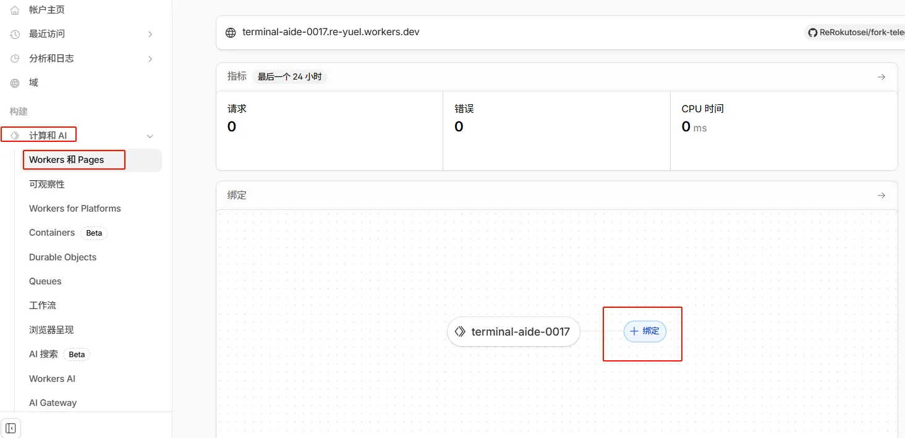
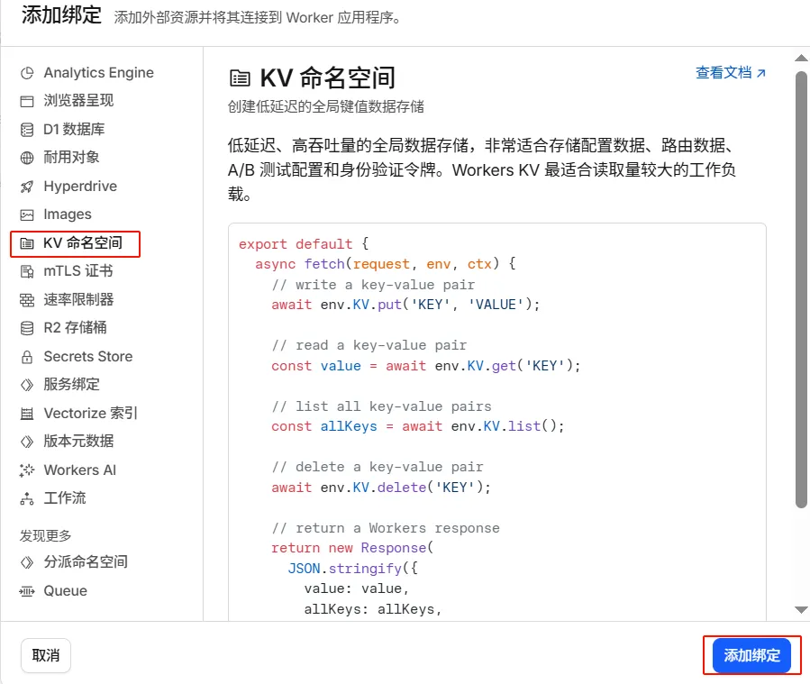
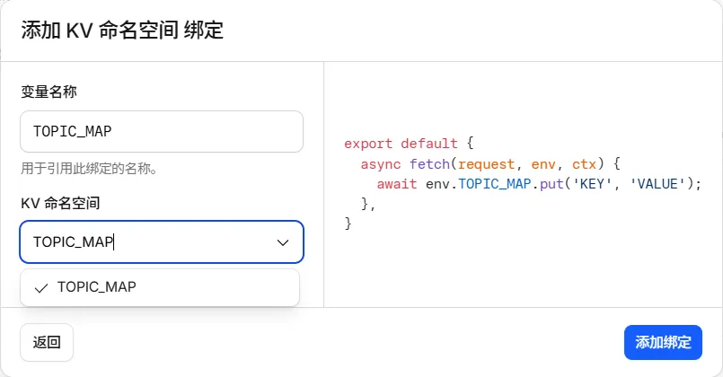
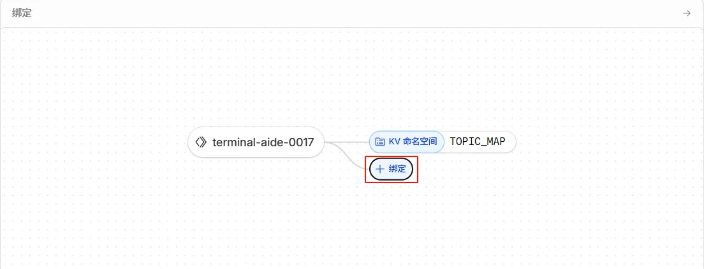
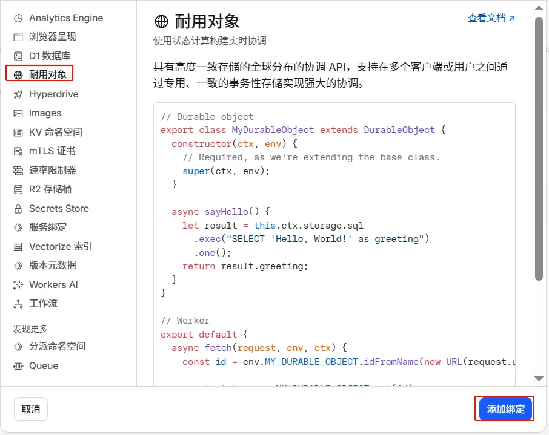
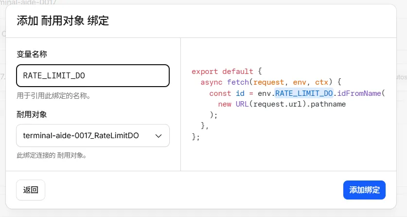

# Telegram 双向转发机器人

> [!TIP]
> （2026.02.03）相对于 [原项目（96ffd6b）](https://github.com/jikssha/telegram_private_chatbot/commit/96ffd6b492694ce68ce0f52d76630b5516425f93)，本 fork **主要变更**：
>
> - [由转发消息重构为**中介模式**，支持 24 小时内**双向消息编辑同步**](https://github.com/ReRokutosei/fork-telegram_private_chatbot/commit/54d5fd13e2f9d4c15066fb75250f452829c2b873)
> - [限流逻辑迁移至 Durable Object，并引入 SQLite + 内存缓存](https://github.com/ReRokutosei/fork-telegram_private_chatbot/commit/d2181a0f9f4ad4cb910b667144074e02d401d7b9)
> - [优化 KV 操作（批量、缓存、重试等）](https://github.com/ReRokutosei/fork-telegram_private_chatbot/commit/ff0736c2798af8a16cd7f6e04f49b559cc696cbb)
> - [新用户或被重建话题的用户接入时，机器人发送**用户资料卡片**](https://github.com/ReRokutosei/fork-telegram_private_chatbot/commit/7d03ae36d377396ebc402eb43d741592ecdfb994)
> - 完善文档步骤说明，**添加截图示意**

本项目是一个基于 **Cloudflare Workers** 的 Telegram 机器人，实现 **用户私聊消息** 与 **群组话题（Topics）** 之间的一对一双向转发。

---

## 目录

- [Telegram 双向转发机器人](#telegram-双向转发机器人)
  - [目录](#目录)
  - [技术概览](#技术概览)
  - [功能特性](#功能特性)
    - [消息与话题管理](#消息与话题管理)
    - [用户与权限控制](#用户与权限控制)
    - [管理功能](#管理功能)
    - [安全与性能](#安全与性能)
  - [部署教程](#部署教程)
    - [步骤 1：Bot Token](#步骤-1bot-token)
    - [步骤 2：管理员群组](#步骤-2管理员群组)
    - [步骤 3：Fork 仓库](#步骤-3fork-仓库)
    - [步骤 4：创建 Worker 应用](#步骤-4创建-worker-应用)
    - [步骤 5：连接 GitHub](#步骤-5连接-github)
    - [步骤 6：配置部署参数](#步骤-6配置部署参数)
    - [步骤 7：绑定 KV 与环境变量](#步骤-7绑定-kv-与环境变量)
    - [步骤 8：激活 Webhook](#步骤-8激活-webhook)
    - [步骤 9：（可选）配置 Durable Object](#步骤-9可选配置-durable-object)
  - [管理员指令说明](#管理员指令说明)
  - [常见问题（FAQ）](#常见问题faq)
  - [安全说明](#安全说明)


---

## 技术概览

* **运行环境**：Cloudflare Workers
* **语言**：JavaScript
* **存储**：Cloudflare KV
* **可选组件**：Durable Object
* **通信方式**：Telegram Bot Webhook

---

## 功能特性

### 消息与话题管理

* 私聊 ↔ 群组话题双向转发
* 每个用户对应一个独立话题
* **自动重建误删话题**
* 支持文本消息与消息编辑同步
* 支持图片、视频、音频、文档、GIF
* 支持媒体组（Media Group）聚合转发

### 用户与权限控制

* 新用户人机验证（按钮式挑战）
* 验证状态带有效期（默认 30 天）
* 永久信任用户机制（`/trust`）
* 用户封禁 / 解封
* 对话关闭 / 重新开启

### 管理功能

* 仅允许管理员在话题内执行管理命令
* 管理员权限缓存，减少 Telegram API 调用
* 自动检测被删除的话题并清理数据

### 安全与性能

* 使用加密安全随机数生成验证 ID
* 用户与管理员权限隔离
* 可选 Durable Object 实现原子级限流
* 并发保护，避免重复创建话题

---

## 部署教程

### 步骤 1：Bot Token

在 Telegram 搜索 [@BotFather](https://t.me/BotFather) 并使用它创建一个 Telegram 机器人，获取 **Bot Token**。
  - 与它对话，输入 `/newbot` 开始创建机器人
  - 按照说明设置机器人昵称和ID
  - 完成之后，它会返回一个 Token ,点击即可复制

### 步骤 2：管理员群组

1. 在 Telegram 创建一个群组
   - 群组类型可为`私人`
2. 在群组设置中启用 **话题功能（Topics）**。
3. 将机器人加入群组，并设置为 **管理员**，且至少授予以下权限：

   * 管理话题（Manage Topics）
   * 删除消息
4. 获取群组 ID（`SUPERGROUP_ID`）：

```
获取 SUPERGROUP_ID 的两种方法：
①使用第三方客户端，比如 Windows 使用 AyuGram ，安卓使用 Nagram X，可直接复制群组 ID
如果只看到纯数字 xxxxxxxxxx，请在前面加上 -100

②在 Telegram 官方桌面端右键群内任意一条消息 → 复制消息链接。
链接中通常包含 -100xxxxxxxxxx 或 xxxxxxxxxx。
如果只看到纯数字 xxxxxxxxxx，请在前面加上 -100。
私有群组 / 频道同样适用。
```

---

### 步骤 3：Fork 仓库

* 将本项目 Fork 到你的 GitHub 账户。
* 修改[wrangler.tomlname](wrangler.toml)
  * 将`name = 'terminal-aide-0017'`改为任意自定义项目名称，**后续需要用到**
  * 注意名称只能包含小写字母（a-z）、数字（0-9）和连字符

### 步骤 4：创建 Worker 应用

1. 登录 [Cloudflare Dashboard](https://dash.cloudflare.com/)。
2. 进入 **Workers 和 Pages**。
3. 点击 **创建应用程序**。


### 步骤 5：连接 GitHub

1. 选择 **Connect to Git** 标签页。
2. 授权 Cloudflare 访问你的 GitHub。
3. 选择你 Fork 的 `telegram_private_chatbot` 仓库。


### 步骤 6：配置部署参数

* **项目名称**：`terminal-aide-0017`
  * 或任意名称，注意要和步骤一的 `name` 对应，否则会部署失败
  * 如果步骤一未更改 `name`，Cloudflare 会在 GitHub 自动发起一个 PR
  * 为避免麻烦和等待，建议在步骤 1 就完成这一步
* **生产分支**：`main`
* 其余选项保持默认
* 点击 **部署**


### 步骤 7：绑定 KV 与环境变量

部署完成后：

1. **创建并绑定 KV 命名空间**：
   * 在左侧菜单 **存储和数据库** -> **Wokers KV** 中创建一个命名空间
   * 点击**Create Instance**，命名空间名称可填写`TOPIC_MAP`


* 返回 Worker 设置页面
	* 左侧菜单栏 -> **计算和 AI** -> **Wokers 和 Pages**
* 在 **KV 命名空间** 中添加绑定：

	* 变量名称：`TOPIC_MAP`（必须全大写）
	* 命名空间：选择刚创建的 KV







2. **添加环境变量**：
  - **Workers和Pages** -> **设置** -> **添加**变量和机密


  - `BOT_TOKEN`：填你的 Telegram Bot Token
  - `SUPERGROUP_ID`：填你的 群组 ID（如 `-100123456789`）
  - 类型均设置为**密钥**
  - 点击**部署**即可完成


---

### 步骤 8：激活 Webhook

这一步需要手动设置 Telegram Webhook。

请在浏览器中访问以下 URL（注意顺序与完整性）：

```
https://api.telegram.org/bot<YOUR_TOKEN>/setWebhook?url=<YOUR_WORKER_URL>
```

说明：

* `<YOUR_TOKEN>`：Telegram Bot Token（`bot` 前缀必须保留）
* `<YOUR_WORKER_URL>`：Worker 的完整访问地址
  （如 `https://xxx.workers.dev` 或你绑定的自定义域名）


* Woker 的访问地址可以在图中的蓝色按钮找到（鼠标右键它以复制 URL）


示例：

```
https://api.telegram.org/bot1234:HUSH2GW/setWebhook?url=https://1234.workers.dev
```

成功则返回：

```json
{"ok":true,"result":true,"description":"Webhook was set"}
```


---

### 步骤 9：（可选）配置 Durable Object

本步骤为启用基于 Durable Object 的强一致性限流机制

未配置 Durable Object 时，机器人仍可正常工作，但限流能力会退化

注意：本步骤**需要先成功部署一次**，面板才会导出我们需要的耐用对象

- 在 耐用对象 中添加绑定：
  - 只需要填写变量名称为 `RATE_LIMIT_DO` 即可
  - 耐用对象是自动导出的 `{ProjectName_RateLimitDO}` ，下拉选中即可
  - 如果没发现有可选的耐用对象，请**至少部署成功一次**再重新绑定







---

## 管理员指令说明

> 所有管理指令 **仅在群组的话题内有效**。
> 私聊中发送的管理指令会被忽略，不会产生任何反馈。

|    指令    | 作用                               |
| :--------: | :-------------------------------- |
|  `/info`   | 显示当前用户 ID、话题 ID、验证状态 |
|  `/close`  | 关闭对话，拒绝该用户的新消息       |
|  `/open`   | 重新开启已关闭的对话               |
|   `/ban`   | 封禁用户                           |
|  `/unban`  | 解封用户                           |
|  `/trust`  | 将用户标记为永久信任               |
|  `/reset`  | 清除验证状态，要求重新验证         |
| `/cleanup` | 清理已被删除话题的残留数据         |

---

## 常见问题（FAQ）

**Q1：机器人无法创建话题？**
<details><summary><strong>点击查看</strong></summary>
A1：请确认：

1. 已启用 Topics
2. 机器人具有管理话题权限
</details>

***

**Q2：验证通过但消息不转发？**
<details><summary><strong>点击查看</strong></summary>
A2：

1. 删除现有 webhook：

```
https://api.telegram.org/bot<TOKEN>/deleteWebhook?drop_pending_updates=true
```

2. 重新设置 webhook
3. 确认变量名和群组 ID 无误

</details>

***

**Q3：机器人无任何反应**
<details><summary><strong>点击查看</strong></summary>
A3: 

一般是 Cloudflare 的问题，当你部署完成后，改动了其他设置或者在 GitHub 推送更新，之前绑定的**KV 命名空间**和**DO 耐用对象**会莫名 失效/消失/自动解绑，请检查并手动重新绑定

注：可以在 Cloudflare Woker面板设置中添加排除监听路径，排除文档变更的 commit 触发重新构建 


</details>

---

## 安全说明
> [!CAUTION]
> * 不要在代码中硬编码 Bot Token
> * KV 数据为明文存储，请勿保存敏感信息
> * 谨慎使用 `/trust` 与 `/ban`
> * 定期执行 `/cleanup` 清理无效数据