# Telegram 双向转发机器人

> [!TIP]
> 相对于 [原项目（96ffd6b）](https://github.com/jikssha/telegram_private_chatbot/commit/96ffd6b492694ce68ce0f52d76630b5516425f93)，本 fork **主要变更**：
>
> （2026.02.22）：
> - 架构重构：将单文件 `worker.js` 拆分为 `src/handlers`、`src/services`、`src/adapters`、`src/core`、`src/config`、`src/do` 分层模块；`main.js` 精简为入口装配
> - 资源与部署 (Important)：资源绑定调整为顶层配置，无需再手动绑定；补充并更新项目结构文档（`docs/tree.md`）
> - 稳定性增强：引入用户级并发锁；新增“新建话题后二次可用性验证 + 重试”；增加消息映射过期清理与定时触发
> - 管理命令完善：统一目标用户解析与失败反馈，支持 `/cmd@BotName`；增强 `/ban` `/unban`（含 `<id>`）可用性与防呆（受保护账号不可封禁）
> - 用户资料展示：新增 `resolveUserProfileStatus`（基于 `getChat` 的名称与账号状态解析，含短 TTL 缓存），并接入 `admin-reply` 与 `cleanup` 输出
> - 关键词与管理细节：新增按 ID 删除关键词、补充表达式限制与测试能力，优化 `/kw list` 分片输出与管理交互反馈
> 
> （2026.02.04）：
> - 引入 D1+KV 混合存储，核心数据迁移至 D1
> - 新增关键词过滤（正则匹配）
> - 新增 `/help` 命令
> 
> （2026.02.03）：
> - [由转发消息重构为**中介模式**，支持 24 小时内**双向消息编辑同步**](https://github.com/ReRokutosei/fork-telegram_private_chatbot/commit/54d5fd13e2f9d4c15066fb75250f452829c2b873)
> - [限流逻辑迁移至 Durable Object，并引入 SQLite + 内存缓存](https://github.com/ReRokutosei/fork-telegram_private_chatbot/commit/d2181a0f9f4ad4cb910b667144074e02d401d7b9)
> - [优化 KV 操作（批量、缓存、重试等）](https://github.com/ReRokutosei/fork-telegram_private_chatbot/commit/ff0736c2798af8a16cd7f6e04f49b559cc696cbb)
> - [新用户或被重建话题的用户接入时，机器人发送**用户资料卡片**](https://github.com/ReRokutosei/fork-telegram_private_chatbot/commit/7d03ae36d377396ebc402eb43d741592ecdfb994)
> - 完善文档步骤说明，**添加截图示意**

本项目是一个基于 **Cloudflare Workers** 的 Telegram 机器人，实现 **用户私聊消息** 与 **群组话题（Topics）** 之间的一对一双向转发。

<div align="center">

⚠️ **【部署前提】** 
**不具备以下账号，请勿尝试部署！**

</div>

> [!CAUTION]
> **❗ 本项目依赖 Cloudflare 生态与 Telegram Bot，部署有不可绕过的硬性前提。若缺少以下任一条件，部署将失败。**
>
> - ✅ **已通过付款验证的 Cloudflare 账号**  
>   - （即使使用免费额度，也必须绑定并成功验证信用卡或 PayPal 等）
> - ✅ **可用的 Telegram 账号**  
>   - （没有 TG 账号你来凑热闹吗？）
>
> - 🔸 **GitHub 账号**：  
>   - 若选择 **手动部署**（在 Cloudflare Dashboard `从Hello World!开始` 直接编辑或导入代码），则 **不需要 GitHub 账号**。  
>   - 若选择 **自动部署**（Fork 本仓库 + Connect to Github），则 **需要 GitHub 账号**。  
>   - 本教程采用 **自动部署方式**，不提供纯手动部署指导。
>
> **❌ 若你没有 Cloudflare 或 Telegram 账号，请不要继续阅读。**
>
> **⛔ 作者不提供无账号支持、代部署、付款验证绕过等任何形式的协助。**

> [!TIP]
> 没有 Cloudflare 账号，建议阅读该项目 -> [fork-tg-pm-bot](https://github.com/ReRokutosei/fork-tg-pm-bot)

---

## 目录

- [Telegram 双向转发机器人](#telegram-双向转发机器人)
  - [目录](#目录)
  - [技术概览](#技术概览)
  - [功能特性](#功能特性)
    - [消息与话题管理](#消息与话题管理)
    - [用户与权限控制](#用户与权限控制)
    - [管理功能](#管理功能)
    - [安全与性能](#安全与性能)
  - [部署教程](#部署教程)
    - [步骤 01：Bot Token](#步骤-01bot-token)
    - [步骤 02：管理员群组](#步骤-02管理员群组)
    - [步骤 03：Fork 仓库](#步骤-03fork-仓库)
    - [步骤 04：创建 Worker 应用](#步骤-04创建-worker-应用)
    - [步骤 05：连接 GitHub](#步骤-05连接-github)
    - [步骤 06：配置部署参数与构建命令](#步骤-06配置部署参数与构建命令)
    - [步骤 07：创建 D1 数据库](#步骤-07创建-d1-数据库)
    - [步骤 08：创建 KV 命名空间](#步骤-08创建-kv-命名空间)
    - [步骤 09：添加环境变量](#步骤-09添加环境变量)
    - [步骤 10：激活 Webhook](#步骤-10激活-webhook)
    - [步骤 11：开始使用](#步骤-11开始使用)
  - [管理员指令说明](#管理员指令说明)
    - [关键词过滤用法](#关键词过滤用法)
  - [常见问题（FAQ）](#常见问题faq)
  - [参考](#参考)


---

## 技术概览

* **运行环境**：Cloudflare Workers
* **语言**：JavaScript
* **存储**：Cloudflare D1 + KV
* **可选组件**：Durable Object
* **通信方式**：Telegram Bot Webhook

---

## 功能特性

### 消息与话题管理

* 私聊 ↔ 群组话题双向转发
* 每个用户对应一个独立话题
* **自动重建误删话题**
* 支持文本消息与消息编辑同步
* 支持图片、视频、音频、文档、GIF
* 支持媒体组（Media Group）聚合转发

### 用户与权限控制

* 新用户人机验证（按钮式挑战）
* 验证状态带有效期（默认 30 天）
* 永久信任用户机制（`/trust`）
* 用户封禁 / 解封
* 对话关闭 / 重新开启
* 关键词过滤（正则匹配）

### 管理功能

* 仅允许管理员在话题内执行管理命令
* 管理员权限缓存，减少 Telegram API 调用
* 自动检测被删除的话题并清理数据
* 关键词过滤管理（`/kw add` / `/kw del` / `/kw list` / `/kw test`）

### 安全与性能

* 使用加密安全随机数生成验证 ID
* 用户与管理员权限隔离
* D1 + KV 混合存储，核心数据持久化、临时数据缓存
* 可选 Durable Object 实现原子级限流
* 并发保护，避免重复创建话题

---

## 部署教程

> [!IMPORTANT]
> 🛑 再次提醒：请确保你已拥有 **Cloudflare、Telegram** 账号。缺少任一将导致部署失败。

### 步骤 01：Bot Token

在 Telegram 搜索 [@BotFather](https://t.me/BotFather) 并使用它创建一个 Telegram 机器人，获取 **Bot Token**。
  - 与它对话，输入 `/newbot` 开始创建机器人
  - 按照说明设置机器人昵称和ID
  - 完成之后，它会返回一个 Token ,点击即可复制

### 步骤 02：管理员群组

1. 在 Telegram 创建一个群组
   - 群组类型可为`私人`
2. 在群组设置中启用 **话题功能（Topics）**。
3. 将机器人加入群组，并设置为 **管理员**，且至少授予以下权限：

   * 管理话题（Manage Topics）
   * 删除消息
4. 获取群组 ID（`SUPERGROUP_ID`）：

```
获取 SUPERGROUP_ID 的两种方法：
①使用第三方客户端，比如 Windows 使用 AyuGram ，安卓使用 Nagram X，可直接复制群组 ID
如果只看到纯数字 xxxxxxxxxx，请在前面加上 -100

②在 Telegram 官方桌面端右键群内任意一条消息 → 复制消息链接。
链接中通常包含 -100xxxxxxxxxx 或 xxxxxxxxxx。
如果只看到纯数字 xxxxxxxxxx，请在前面加上 -100。
私有群组 / 频道同样适用。
```

---

### 步骤 03：Fork 仓库

* 将本项目 Fork 到你的 GitHub 账户。
* 修改文件 **wrangler.toml**
  * 将`name = 'terminal-aide-0017'`改为任意自定义项目名称，**后续需要用到**
  * 注意名称只能包含小写字母（a-z）、数字（0-9）和连字符

### 步骤 04：创建 Worker 应用

1. 登录 [Cloudflare Dashboard](https://dash.cloudflare.com/)。
2. 进入 **Workers 和 Pages**。
3. 点击 **创建应用程序**。

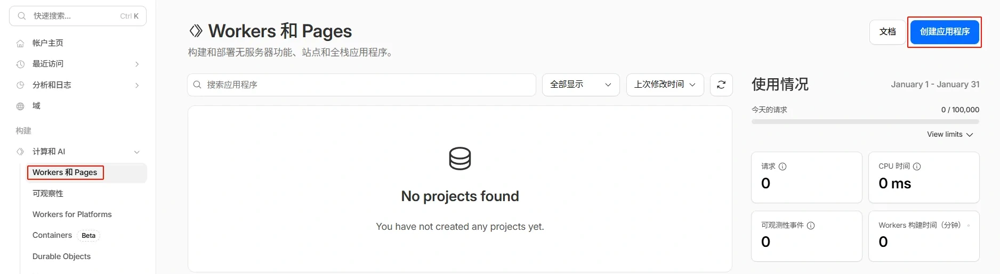

### 步骤 05：连接 GitHub

1. 选择 **Connect to Github** 标签页。
2. 授权 Cloudflare 访问你的 GitHub。
3. 选择你 Fork 的 `telegram_private_chatbot` 仓库。

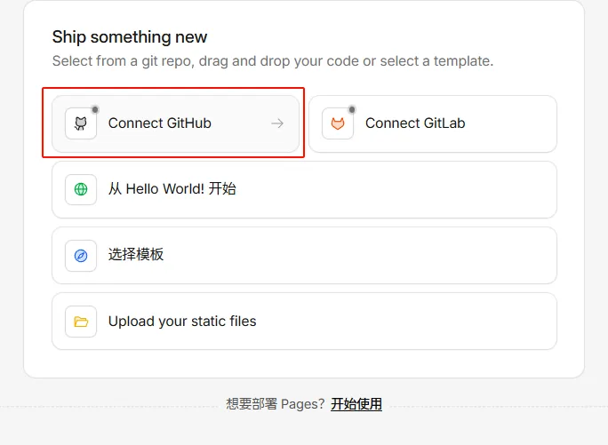

### 步骤 06：配置部署参数与构建命令

* **项目名称**：`terminal-aide-0017`
  * 或任意名称，注意要和步骤一的 `name` 对应，否则会部署失败
  * 如果步骤一未更改 `name`，Cloudflare 会在 GitHub 自动发起一个 PR
  * 为避免麻烦和等待，建议在步骤 01 就完成这一步
* **生产分支**：`main`
* 其余选项保持默认
* 点击 **部署**

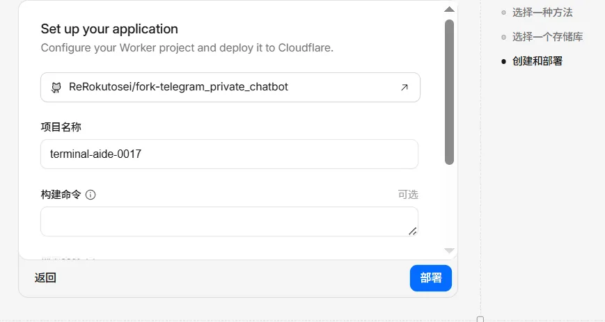

* **配置构建命令（Build Command）**

> [!IMPORTANT]
> 本步骤是关键：通过构建命令，CF 会在每次部署前将真实的 D1/KV ID 注入到 `wrangler.toml`。
> 这样绑定定义在代码中，**不会因重新部署而丢失**，也不需要手动在面板绑定。

首次部署完成后，进入 Worker → **设置** → **构建**（Build）：

1. **Build command** 填写：

```
sed -i "s|REPLACE_WITH_D1_DATABASE_ID|${CF_D1_DATABASE_ID}|g" wrangler.toml && sed -i "s|REPLACE_WITH_KV_NAMESPACE_ID|${CF_KV_NAMESPACE_ID}|g" wrangler.toml
```

2. 添加 **构建环境变量**（加密）：

| 变量名 | 值 | 说明 |
|---|---|---|
| `CF_D1_DATABASE_ID` | 你的 D1 数据库 ID | 在步骤 07 创建后获取 |
| `CF_KV_NAMESPACE_ID` | 你的 KV 命名空间 ID | 在步骤 08 创建后获取 |

> **D1 数据库 ID** 和 **KV 命名空间 ID** 分别在步骤 07 和步骤 08 创建资源后即可看到。
> 获取后回到此处填入构建环境变量，然后触发一次重新部署即可生效。

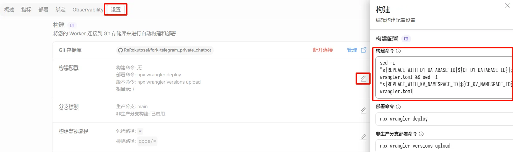
***
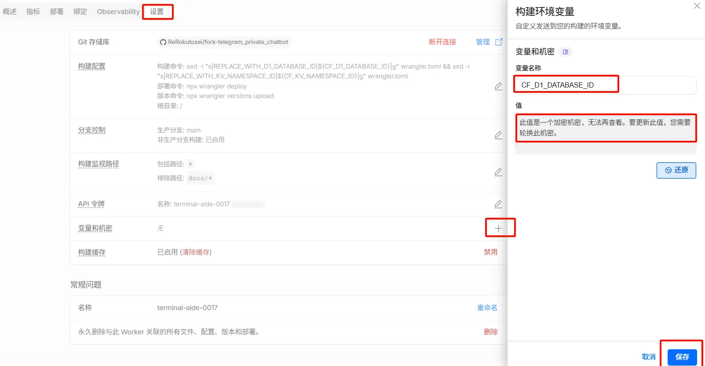
***
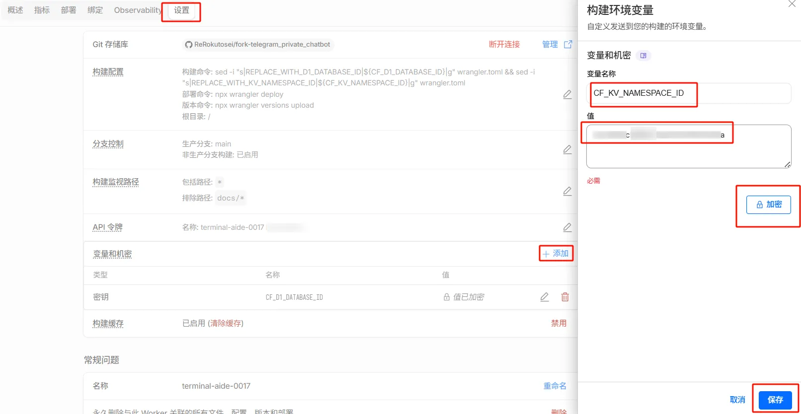
***
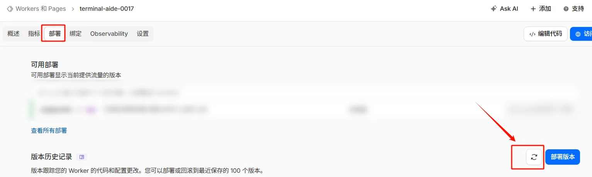

### 步骤 07：创建 D1 数据库

1. 进入 **存储和数据库** -> **D1 SQL 数据库**
2. 点击 **创建数据库**，名称可填写 `tg-bot-db`（或任意名称）
	- 数据库名称只能包含小写字母 (a-z)、数字 (0-9)、下划线 (_) 和连字符 (-)

3. **数据位置** 让CF自动选择即可
4. 进入数据库 **控制台**，执行以下建表 SQL：

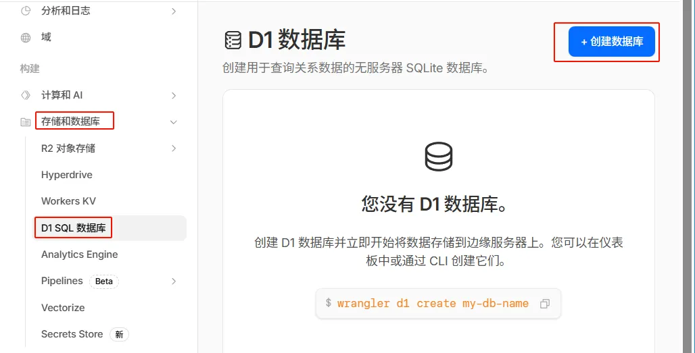

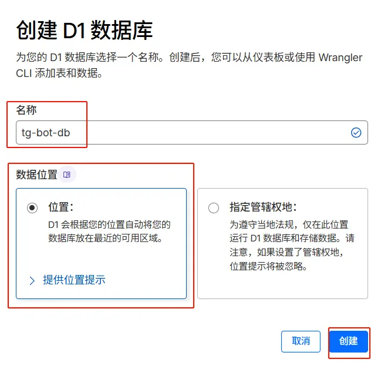

> [!CAUTION]
> ⚠️ **注意**：控制台一次仅支持执行一条 SQL 语句
>
> 请**逐条复制并执行**以下命令，不要一次性粘贴全部内容！
>
> 也不要忘记语句末尾的分号！
>
> - 复制第一条（从 `CREATE TABLE users` 到它后面的 `;`）
> - 粘贴到 D1 控制台 → 点击“运行”
> - 成功后，再复制下一条（比如 `CREATE TABLE messages` 到它的 `;`）
> - 重复直到全部语句执行完毕

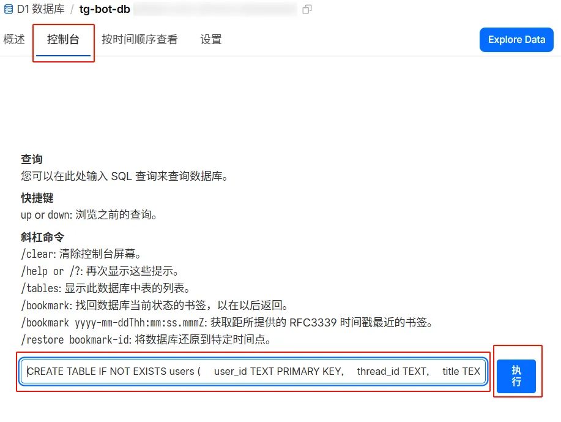

```sql
CREATE TABLE IF NOT EXISTS users (
    user_id TEXT PRIMARY KEY,
    thread_id TEXT,
    title TEXT,
    closed INTEGER,
    verify_state TEXT,
    verify_expires_at INTEGER,
    is_blocked INTEGER,
    user_info_json TEXT,
    created_at INTEGER,
    updated_at INTEGER
);

CREATE TABLE IF NOT EXISTS messages (
    source_chat_id TEXT,
    source_msg_id TEXT,
    target_chat_id TEXT,
    target_msg_id TEXT,
    created_at INTEGER,
    PRIMARY KEY (source_chat_id, source_msg_id)
);

CREATE TABLE IF NOT EXISTS threads (
    thread_id TEXT PRIMARY KEY,
    user_id TEXT
);

CREATE TABLE IF NOT EXISTS keywords (
    id INTEGER PRIMARY KEY AUTOINCREMENT,
    keyword TEXT UNIQUE,
    created_at INTEGER
);

CREATE TABLE IF NOT EXISTS config (
    key TEXT PRIMARY KEY,
    value TEXT
);

-- 索引优化（提升 thread_id/状态统计的查询性能）
CREATE INDEX IF NOT EXISTS idx_users_thread_id ON users(thread_id);
CREATE INDEX IF NOT EXISTS idx_users_updated_at ON users(updated_at);
CREATE INDEX IF NOT EXISTS idx_users_verify_state ON users(verify_state);
CREATE INDEX IF NOT EXISTS idx_users_is_blocked ON users(is_blocked);
```

上述索引主要优化 `thread_id` 反查、活跃排序、验证与封禁统计等高频查询。

> 可选维护建议：数据库迁移或大量写入后，可在 D1 控制台执行 `PRAGMA optimize;` 进行轻量优化。

全部执行完毕，你应该能看到类似下图：

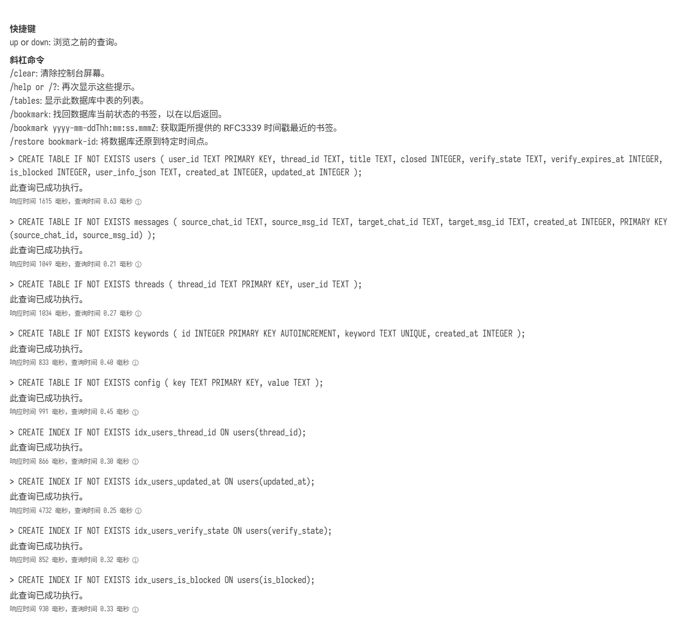

> 创建完成后，复制 D1 数据库 ID 并找个文档记录，等待步骤08完成

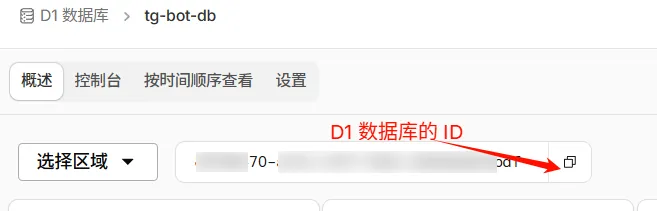

### 步骤 08：创建 KV 命名空间

- 在左侧菜单 **存储和数据库** -> **Workers KV** 中创建一个命名空间
- 点击 **Create Instance**，命名空间名称可填写 `TOPIC_MAP`

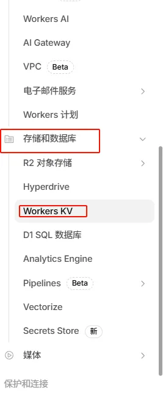

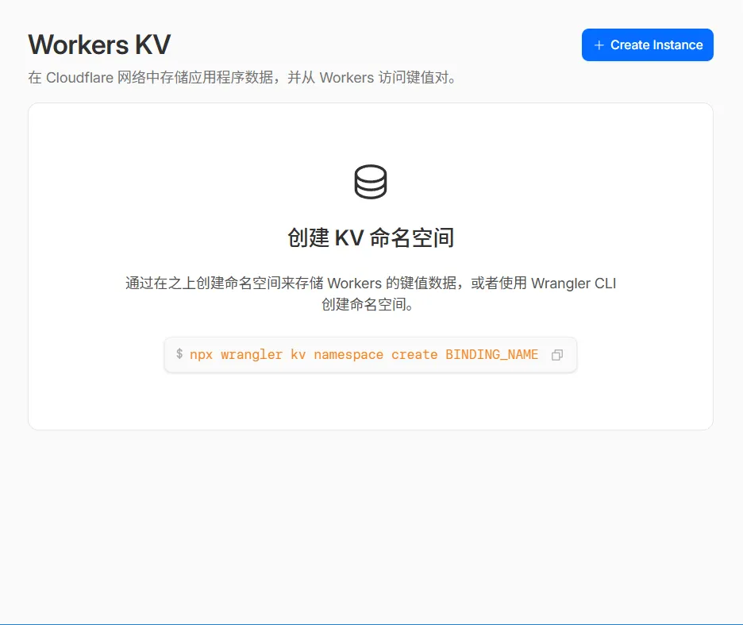

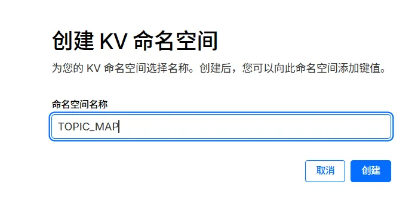

> 创建完成后，复制 KV 命名空间 ID，回到**步骤 06** 填入构建环境变量 `CF_KV_NAMESPACE_ID`和上一步的 `CF_D1_DATABASE_ID`。

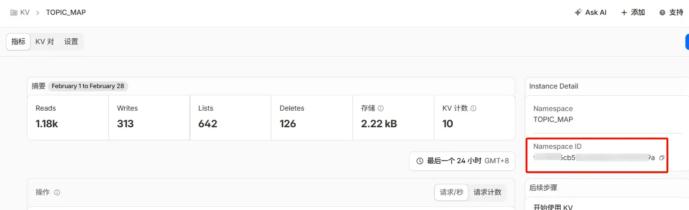

---

### 步骤 09：添加环境变量
**Workers和Pages** -> **设置** -> **添加**变量和机密

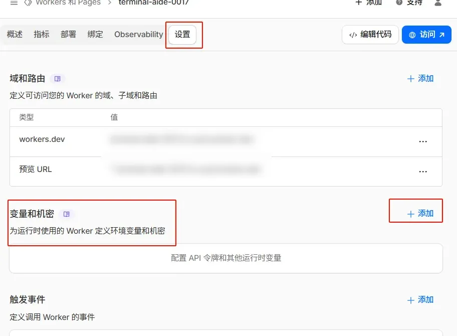

  - `BOT_TOKEN`：填你的 Telegram Bot Token
  - `SUPERGROUP_ID`：填你的 群组 ID（如 `-100123456789`）
  - 类型均设置为**密钥**
  - 点击**部署**即可完成

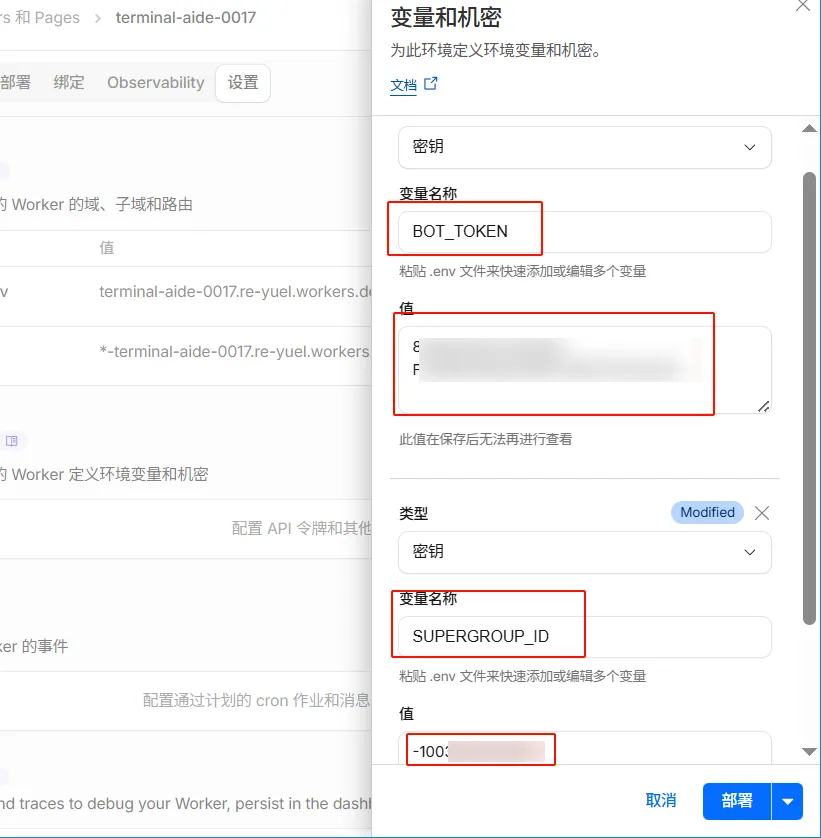

---

### 步骤 10：激活 Webhook

这一步需要手动设置 Telegram Webhook。

请在浏览器中访问以下 URL（注意顺序与完整性）：

```
https://api.telegram.org/bot<YOUR_TOKEN>/setWebhook?url=<YOUR_WORKER_URL>
```

说明：

* `<YOUR_TOKEN>`：Telegram Bot Token（`bot` 前缀必须保留）
* `<YOUR_WORKER_URL>`：Worker 的完整访问地址
  （如 `https://xxx.workers.dev` 或你绑定的自定义域名）


* Woker 的访问地址可以在图中的蓝色按钮找到（鼠标右键它以复制 URL）
  * 该按钮也可以用于验证部署情况，直接点击该访问按钮，跳转的网址也应该返回一个 `OK`，否则，请检查步骤

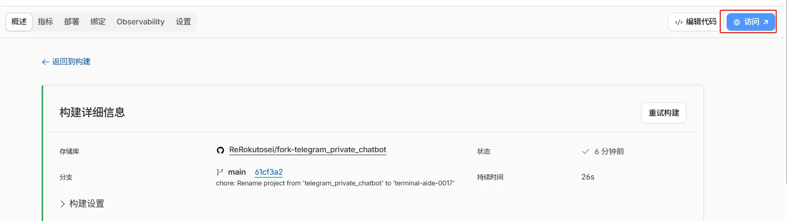

示例：

```
https://api.telegram.org/bot1234:HUSH2GW/setWebhook?url=https://1234.workers.dev
```

成功则返回：

```json
{"ok":true,"result":true,"description":"Webhook was set"}
```

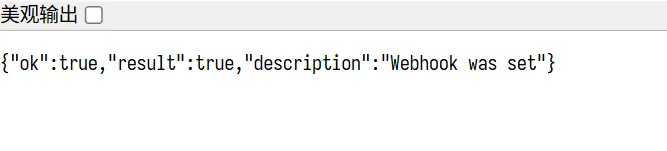

---

### 步骤 11：开始使用
最后一步

将你创建的机器人名字写到 tg 账号资料卡的简介即可

比如 `请通过 @My_bot联系我，直接私聊将被静默归档且拉黑`，记得 `@` 的前面留一个空格，以便 tg 识别

> [!TIP]
> **Durable Object（限流）** 的绑定也已在 `wrangler.toml` 中定义，无需手动配置。
> 首次成功部署后会自动注册并绑定 DO 类。

---

## 管理员指令说明

> 所有管理指令 **仅在群组内有效**。
> 私聊中发送的管理指令会被忽略，不会产生任何反馈。
> 其中 `/ban <id>`、`/unban <id>`、`/kw list` 可在**任意话题**内执行。

|    指令    | 作用                               |
| :--------: | :-------------------------------- |
|  `/info`   | 显示当前用户 ID、话题 ID、验证状态 |
|  `/close`  | 关闭对话，拒绝该用户的新消息       |
|  `/open`   | 重新开启已关闭的对话               |
|   `/ban`   | 封禁用户                           |
| `/ban <id>` | 按用户 ID 封禁（任意话题可用）     |
|  `/unban`  | 解封用户                           |
| `/unban <id>` | 按用户 ID 解封（任意话题可用） |
|  `/trust`  | 将用户标记为永久信任               |
|  `/reset`  | 清除验证状态，要求重新验证         |
| `/cleanup` | 清理已被删除话题的残留数据         |
|  `/help`   | 查看管理员指令帮助                 |
| `/kw add`  | 添加关键词过滤                  |
| `/kw del`  | 删除关键词过滤                  |
| `/kw del id <id>` | 按 ID 删除关键词过滤          |
| `/kw list` | 查看关键词列表（任意话题可用）  |
| `/kw test` | 测试正则表达式                  |
| `/kw help` | 查看关键词管理帮助                |

### 关键词过滤用法

1. 添加关键词  
在话题内发送：`/kw add 关键词`

2. 删除关键词  
在话题内发送：`/kw del 关键词`

3. 查看关键词 ID 及列表  
在话题内发送：`/kw list`

4. 删除关键词（按 ID）  
在话题内发送：`/kw del id <id>`

5. 测试表达式  
在话题内发送：`/kw test <表达式> <文本>`

> [!TIP]
> - 说明：关键词使用**正则匹配**。表达式语法错误会提示失败，可用 `/kw test` 先验证。
> - `/kw list` 会显示关键词的 `id`，删除时可用 `/kw del id <id>` 删除。
> - 关键词长度上限为 **200** 字符，超出会被拒绝。
> - 过滤时仅匹配消息的前 **4000** 字符，以降低性能风险。
> - 以下高风险正则会被拒绝：
>   - `.*` 或 `.+` 出现次数 **超过 2 次** 会被拒绝。
>   - **嵌套量词**会被拒绝（示例：`(a+)+`、`(.+)+`、`(.+)*`、`(.*)+`）。
>   - **重复量词包裹高风险匹配**会被拒绝（示例：`(.*){2,}`、`(.+){1,}`）。
> - 部分第三方客户端有 `发送消息Pangu化` 这个设置项，设置、测试关键词时，请关闭该设置项，以免表达式错误
>   - `发送消息Pangu化`: 使文字更具可读性。在CJK（中文、日文、韩文）、半宽英文、数字和符号字符之间的间隔中自动插入空格。

**示例用法**

1. 添加关键词示例 I
`/kw add 退款`

2. 添加关键词示例 II
`/kw add (优惠|折扣|返现)`

3. 测试规则  
`/kw test (优惠|折扣|返现) 这个是折扣信息`

4. 查看已设置关键词与删除  
`/kw list`  
`/kw del 退款`

5. 按 ID 删除  
`/kw del id 23`

6. 查看帮助  
`/kw help`

---

## 常见问题（FAQ）

**Q1：机器人无法创建话题？**
<details><summary><strong>点击查看</strong></summary>
A1：请确认：

1. 已启用 Topics
2. 机器人具有管理话题权限
</details>

***

**Q2：验证通过但消息不转发？**
<details><summary><strong>点击查看</strong></summary>
A2：

1. 删除现有 webhook：

```
https://api.telegram.org/bot<TOKEN>/deleteWebhook?drop_pending_updates=true
```

2. 重新设置 webhook
3. 确认变量名和群组 ID 无误

</details>

***

**Q3：机器人无任何反应**
<details><summary><strong>点击查看</strong></summary>
A3:

所有资源绑定（D1、KV、DO）已在 `wrangler.toml` 中定义，并通过构建命令自动注入真实 ID，每次部署都会自动生效。如果仍无反应，请检查：

1. 构建环境变量 `CF_D1_DATABASE_ID` 和 `CF_KV_NAMESPACE_ID` 是否正确填写
2. 构建命令（Build Command）是否正确配置
3. 在 Worker 部署日志中查看是否有报错

注：可以在 Cloudflare Worker 面板设置中添加排除监听路径，排除文档变更的 commit 触发重新构建

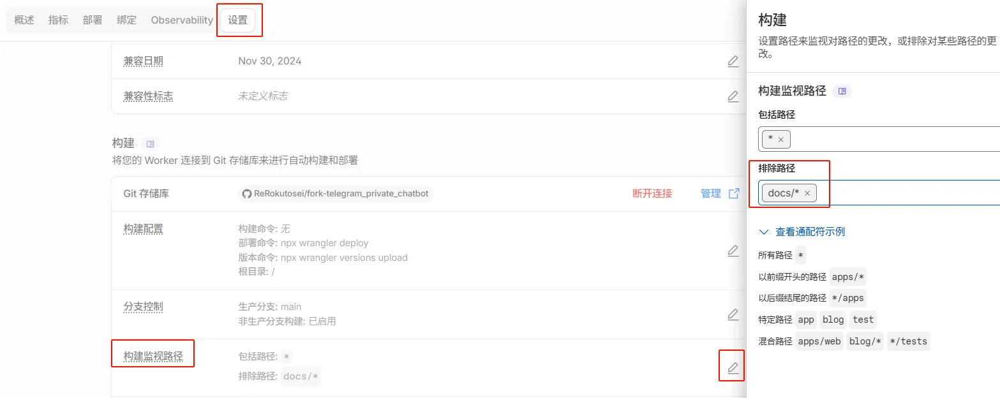

</details>

---

## 参考

1. https://github.com/lige47/tg-pm-bot
2. https://github.com/moistrr/TGbot-D1/

<div style="text-align: center;"><strong>如果对你有帮助还请点个⭐！</strong></div>

